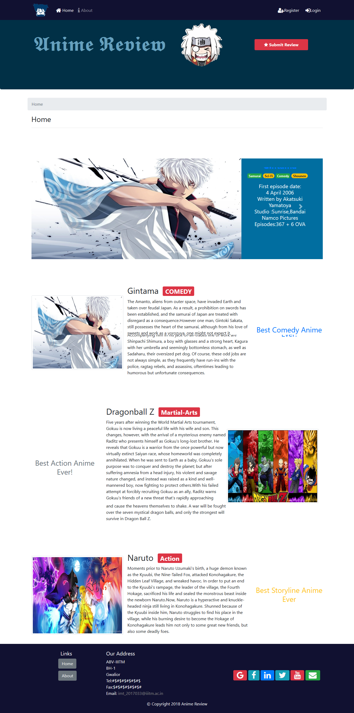
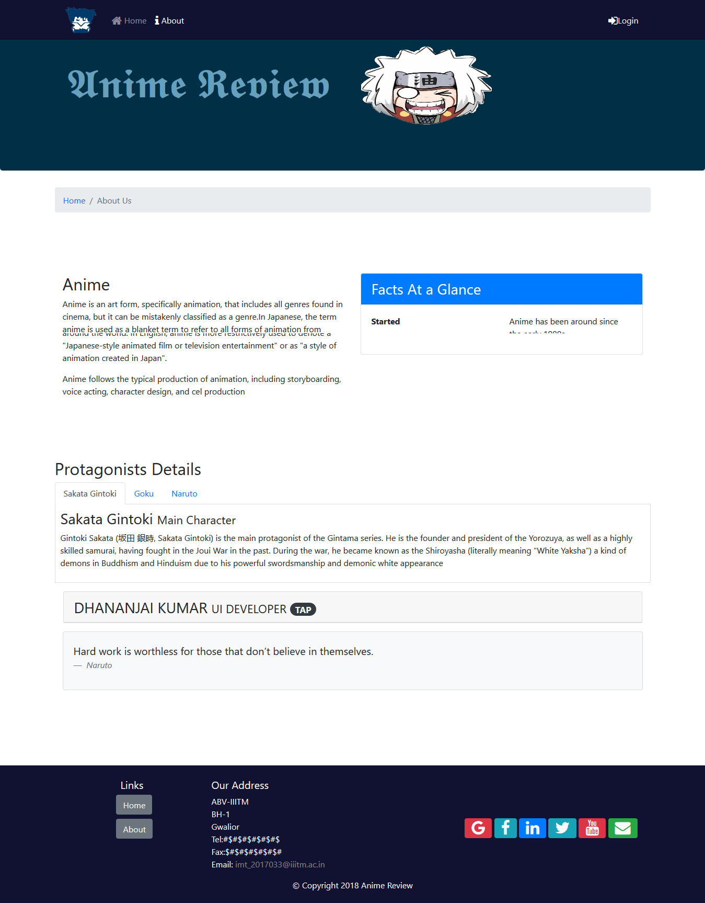

# Anime-Review
## Simple Frontend UI made with HTML5,CSS3,Bootstrap4 
## Make a pull request to use the project and run "npm install" to install all dependancies

### **This is the Home Page:** 

 

 
### **Here we have an illustration of login and review modal:** 

   

 

### **Here we have carousel of Anime**

 

### **Finally we have about page**

 

 

